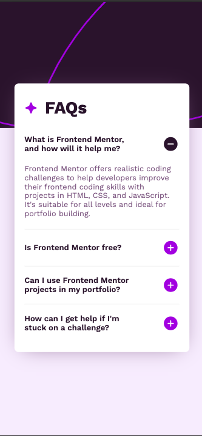
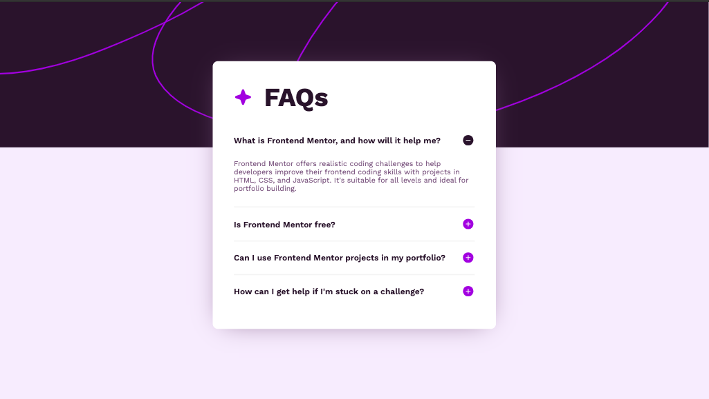

# Frontend Mentor - FAQ accordion solution

This is a solution to the [FAQ accordion challenge on Frontend Mentor](https://www.frontendmentor.io/challenges/faq-accordion-wyfFdeBwBz). Frontend Mentor challenges help you improve your coding skills by building realistic projects.

## Table of contents

- [Overview](#overview)
  - [The challenge](#the-challenge)
  - [Screenshot](#screenshot)
  - [Links](#links)
- [My process](#my-process)
  - [Built with](#built-with)
  - [What I learned](#what-i-learned)
  - [Continued development](#continued-development)
  - [Useful resources](#useful-resources)
- [Author](#author)
- [Acknowledgments](#acknowledgments)

## Overview

### The challenge

Users should be able to:

- Hide/Show the answer to a question when the question is clicked
- Navigate the questions and hide/show answers using keyboard navigation alone
- View the optimal layout for the interface depending on their device's screen size
- See hover and focus states for all interactive elements on the page

### Screenshot




### Links

- Solution URL: [Add solution URL here](https://github.com/laurellx/FEM-accordion)
- Live Site URL: [Add live site URL here](https://your-live-site-url.com)

## My process

Despite the semplicity of the project, it took me some time to complete it as it had been a while since I worked with JS.
I followed the instructions and created the html template, arranging its elements by following the designs provided in the starter pack. Once I organized the HTML tags as I considered more appropriate, I worked on the CSS part using SASS code nesting. I applied the mobile-first design approach.
For the script part, I worked with the DOM elements that are involved in the dynamic changes of the project and the addEventListener() method.
Finally, I went back to SASS and created the mixins that allowed me to make the project responsive and perfected the desktop design of the project; the tablet version was not provided on the guidelines, but I wanted to make sure the appearence of the FAQ accordion is suitable for tablet screens as well.

### Built with

- Semantic HTML5 markup
- CSS custom properties
- SASS
- JavaScript
- DOM manipulation
- Flexbox
- Mobile-first workflow
- [Angular](https://angular.io/) - Angular

### What I learned

For this little project I did not have to face anything that I had not seen before, but I think that the most interesting piece of code I worked on is the below CSS:

```css
@mixin responsive($size) {
  $query: map-get($breakpoints, $size);

  @media (min-width: #{$query}) {
    @content;
  }
}
```

As I mentioned in other sections, I took the chance to review SASS and its features, especially mixins, and I used them to make the webpage responsive. I did not create many breakpoints for this project as it required just two screen designs, but I will for sure implement this strategy in future projects as well.
Check [Useful resources](#useful-resources) for source information.

### Continued development

Working on this project made me realise I want to keep working on learning SASS and all its features more in depth; I have loved it since the beginning because of the possibility to nest code within other code and have a clear view of hierarchies, but the power of mixins and inheritance is something I want to explore more in the future.

### Useful resources

- [How to create a SASS (SCSS) mixin for responsive design](https://adrianmanduc.medium.com/how-to-create-a-scss-mixin-for-responsive-design-8aad4f70f1d5) - This article helped me with the creation of the responsive desktop design using SASS instead of media queries.

## Author

- Frontend Mentor - [@laurellx](https://www.frontendmentor.io/profile/laurellx)
- LinkedIn -[@lauraoriga](https://www.linkedin.com/in/lauraoriga/)

## Acknowledgments

As this is my very first FEM project, I would like to thank the professor Belén, who recommended the website to me and my colleagues during the bootcamp. And I would also like to give some credit to myself, for finally completing a project; despite how little it might seem, it is a big step and, hopefully, just the first of a long series.
